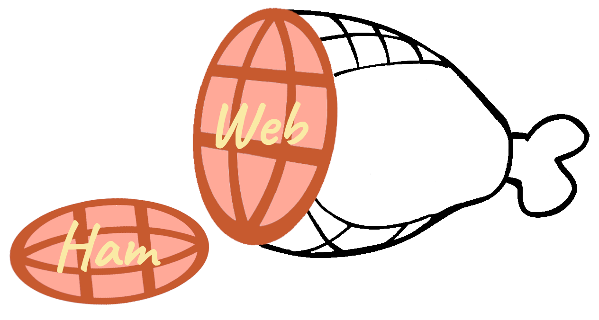

<p align="center">
  <a href="https://web-ham.com">
    
  </a>
</p>

<div align="center">

[](https://github.com/rfvx/web-ham/blob/main/LICENSE)
[](https://github.com/rfvx/web-ham/stargazers)
[](https://github.com/rfvx/web-ham/releases)

</div>

<p align="center">
  <a href="https://web-ham.com"><strong> Try it now at web-ham.com →</strong></a>
</p>

<p align="center">
  <strong>Web Ham is a versatile ham radio web-app that allows for many different modes of operation(FT8, SSTV, POTA, etc.) to be run with one connection to the radio, and all in the browser.</strong>
</p>


> ⚠️ **This is experimental alpha software, largely written by AI.**
> Read [warning](#warning) before you start using it.

---

## Overview
### The mini-app system

The core of Web Ham, and where it really shines, is it's mini-app system. It is a modular system that allows the user to choose which features they want to use and makes switching between different modes of operation easy, with no having to mess around with the CAT, audio, or even logging settings of each app. How it works is that every functionality is it's own "mini-app"; for example, there is a FT8 mini-app, a logbook mini-app, and a map mini-app, and users can choose to have two apps in split-screen, or have one take up the whole screen. This causes Web Ham to be flexible and able to adapt to different styles of operating. You can see more details about mini-apps in [`docs/architecture.md`](docs/architecture.md)

### All you need is a device with a browser that supports Web Serial.

Because it is a web-app, Web Ham is able to be run on almost all operating systems and browsers, including Linux, MacOS, and Windows and Firefox or a Chromium based browser(Chrome, Edge, Brave, etc.)

## Warning

Please read this part properly.

- **This is alpha. It is for testing and experimenting, not a stable application.** Use your own discretion when using Web Ham.
- **It was largely generated by AI**, not written by hand. Treat the code with the
  skepticism. If you are qualified to review it, please do. 
- **Satellite split-tune is known to be broken for non-Yaesu radios**, and some
  radio profiles have never been tested against real hardware at all. The known
  problems are written down in [`docs/architecture.md`](docs/architecture.md)
  rather than hidden.
- **You are responsible for what your station transmits.** Your license, your
  callsign, your responsibility

Web Ham is offered as-is, with no warranty of any kind.


## Contributions are welcome 
[CONTRIBUTING.md](CONTRIBUTING.md) explains how the project is laid out and what
a good change looks like.

## Run it
You can access it at [web-ham.com](https://web-ham.com), or locally:

With Node:

```bash
npm start
```

With Linux native Perl:

```bash
./start-server.sh
```

Or with PowerShell only:

```powershell
powershell -ExecutionPolicy Bypass -File .\start-server.ps1
```

Then open <http://localhost:4173>.

### Network binding

The server binds `127.0.0.1` by default. It holds your LoTW `.p12` and proxies
your QRZ / HamQTH / LoTW credentials, none of which should be reachable from
the LAN over plaintext HTTP.

To reach it from another device on your network — testing mobile layouts on a
phone, for example — opt in explicitly:

```bash
HOST=0.0.0.0 npm start
```

Note that Web Serial and PWA install both require a secure context, so over a
plain `http://192.168.x.x` origin you get layout testing only, not radio
control. With a wildcard `HOST` the API's Host allowlist is skipped, leaving
only a same-origin check — set `ALLOWED_HOSTS=host:port,...` to name the hosts
you actually use and keep the allowlist active.

Set `TRUST_PROXY=1` when running behind a reverse proxy so `X-Forwarded-For` is
used for per-IP rate limiting. Without it every request behind the proxy shares
one IP and the limits become per-server.

## For developers

There is **no build step**. Native ES modules, served statically. No bundler, no
TypeScript, no npm runtime dependencies — `npm start` just serves the directory.

```text
js/main.js          entry point — builds ctx, mounts the shell, then the apps
js/shell/           tab bar, theme, panel collapse, VFO header, notice strip
js/apps/<id>/       one folder per mini-app
js/connectors/      shared services (cat, audio, logbook, spots, lookup,
                    settings, rotator) — each an EventTarget
```

The layering rule: `main → shell + apps → connectors → utils`. A mini-app never
imports another mini-app; everything it needs arrives through one `ctx` object.

- [`docs/architecture.md`](docs/architecture.md) — the full structure, the event
  channels, and the known wrinkles.
- [`CONTRIBUTING.md`](CONTRIBUTING.md) — how to set up, what each kind of change
  needs, and how changes get reviewed.

```bash
./check.sh                # JS syntax, required element IDs, duplicate IDs, CSS
node test-cat-codecs.mjs  # CAT wire codecs
node test-grid.mjs        # Maidenhead / distance / bearing
```

## Notes on specific radios

- Each profile loads its own default serial settings and mode list.
- The Yaesu FT-897 / FT-857 / FT-817 family uses `4800`, `8N2`, and binary CAT.
- Kenwood and generic ASCII profiles default to `9600`, `8N1`, text commands.
- The FlexRadio profile targets a **SmartCAT virtual COM port**. Browsers cannot
  open SmartCAT TCP ports directly without a local bridge. SmartSDR supports
  both Flex `ZZ...` commands and a subset of Kenwood TS-2000 CAT, so this
  profile uses SmartCAT-friendly ASCII for frequency, mode, and PTT.
- FT8 decode and encode both run through a vendored local `ft8js` WASM bundle,
  so no CDN fetch happens at runtime.
- The map's base tiles come from OpenStreetMap and do require connectivity.

## License

[MIT](LICENSE)

The vendored bundles under `vendor/` (`ft8js`, `mqtt`) are third-party code
under their own upstream licenses, not covered by the above.
