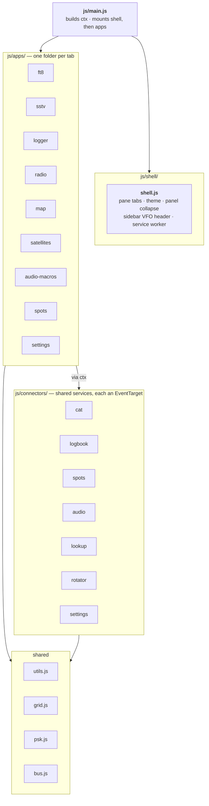

# WebHam Architecture

WebHam is a browser-based amateur radio console: CAT control over Web Serial, FT8,
SSTV, logging, satellite tracking and mapping.

**No build step.** Native ES modules served statically. There is no bundler, no
TypeScript, and no npm runtime dependency — `npm start` just serves the directory.

## The rule

Dependencies run strictly downward:

```
main  →  shell + apps  →  connectors  →  utils / grid
```

- A mini-app **never** imports another mini-app.
- A connector **never** imports an app or the shell.
- Everything an app needs arrives through one `ctx` object, handed to it at mount.
- Only a connector dispatches its own events. Nothing dispatches *into* a connector
  from outside.

Keeping this direction acyclic is what lets mini-apps be added, changed, or broken
in isolation.

## Layout



The diagram shows the permitted *direction*; the matrix below shows which app
actually uses which connector.

## Layers

### Entry — `js/main.js`

Imports the connectors, assembles `ctx`, calls `mountShell(apps, ctx)`, then mounts
each app. The shell runs first because it places the tab panels the apps attach to.

### Shell — `js/shell/shell.js`

The frame every app lives inside: the pane tab manager, tab switching, theme,
panel collapse state, the persistent sidebar VFO header, and service-worker
registration. It owns chrome that exists outside any single tab.

### Mini-apps — `js/apps/<id>/index.js`

One folder per tab. Each exports:

```js
export default {
  id: "ft8",            // matches the #tab-<id> panel in index.html
  title: "FT8",
  mount(panelEl, ctx) { /* query own elements, bind handlers, subscribe */ },
};
```

An app owns its panel's DOM and its own state. It reaches services through `ctx`
and talks to other apps only over the bus.

| App | Responsibility |
| --- | --- |
| `ft8` | FT8 session, waterfall, decode pipeline, auto-sequencing, TX (`index` · `audio` · `decode` + vendored codecs) |
| `sstv` | SSTV encoder/decoder, 15+ modes, VIS auto-detect |
| `logger` | Logbooks, QSO entry/edit, dupe detection, ADIF/Cabrillo, LoTW |
| `audio-macros` | Voice keyer, recorded/TTS macros, audio monitor |
| `radio` | Radio console, frequency/mode/PTT, CW macros, dashboard |
| `map` | Leaflet map, QSO/spot/grid layers, PSKReporter overlay |
| `satellites` | TLE fetch, pass prediction, Doppler split-tune, rotator |
| `settings` | Station details, credentials, theme, FT8 colors |
| `spots` | POTA cluster list and filtering |

### Connectors — `js/connectors/<name>.js`

Shared services. Each is an `EventTarget` with methods, owning one external
concern and the state that goes with it.

| Connector | Owns |
| --- | --- |
| `cat` | Web Serial session, 111 radio profiles, wire codecs (CI-V / Yaesu 5-byte / ASCII), polling, frequency/mode/PTT |
| `logbook` | Logbooks and QSO store, dupe queries, ADIF/Cabrillo generation, LoTW matching |
| `spots` | POTA spot fetching, PSKReporter MQTT feed, spot filtering |
| `audio` | Audio device config, per-app input/output routing, device enumeration |
| `lookup` | QRZ / HamQTH callsign lookup, park name lookup, nearby references |
| `rotator` | Az/el rotator serial port |
| `settings` | Persisted preferences (`get` / `set` / `clear`) |

### Shared — `js/utils.js`, `js/grid.js`, `js/psk.js`, `js/bus.js`

Pure helpers with no DOM or connector dependencies. `utils.js` is formatting and
band math; `grid.js` is Maidenhead/bearing/band-color math; `js/psk.js` is the
PSKReporter topic/spot helpers the `spots` connector uses; `bus.js` is a single
`EventTarget` for app-to-app events.

## Which app uses which connector

| App | cat | audio | logbook | spots | lookup | settings | rotator | bus |
| --- | :-: | :-: | :-: | :-: | :-: | :-: | :-: | :-: |
| `ft8` | ● | ● | ● | | | | | ● |
| `logger` | ● | | ● | | ● | ● | | ● |
| `radio` | ● | ● | | ● | | | | ● |
| `map` | ● | | ● | ● | | | | ● |
| `sstv` | | ● | ● | | | ● | | |
| `satellites` | ● | | | | | | ● | ● |
| `audio-macros` | ● | ● | | | | | | ● |
| `spots` | ● | | | ● | | | | ● |
| `settings` | | ● | | | | ● | | ● |

## Events

Two channels, kept deliberately separate.

**Connector events** describe the outside world — a radio, a feed, a store — and
are dispatched only by the connector that owns them:

| Connector | Events |
| --- | --- |
| `cat` | `status` · `frequency` · `mode` · `ptt` · `disconnect` · `serial-log` |
| `spots` | `pota` · `psk` · `log` |
| `logbook` | `change` · `logbooks-change` |
| `audio` | `devices-change` · `log` |
| `settings` | `change` |
| `rotator` | `status` · `serial-log` |

**Bus events** (`ctx.bus`) carry app-to-app requests that belong to no connector:

`prefill-log` · `tune-and-prefill-spot` · `spots-filter-changed` · `map-refresh` ·
`ft8-decodes` · `ft8-log` · `ft8-session-stopping` · `ft8-preview-refresh` ·
`serial-log` · `activate-tab` · `tab-activated` · `radio-profile-changed` ·
`radio-console-sync` · `dupe-banner-refresh` · `freq-band-chip-refresh` ·
`frequency-display-updated` · `voice-keyer-refresh`

Prefer a connector over the bus. Reach for the bus only when the traffic is
genuinely between two apps.

**App capabilities on `ctx`.** A few reads need live state from another app
synchronously, where a fire-and-forget bus event doesn't fit. An owning app
registers an accessor object on the shared `ctx` at mount — `ctx.ft8` (session
state, worked calls, decode history) and `ctx.logger` (QSO form helpers) — which
other apps read lazily and optional-chained (`ctx.ft8?.sessionRunning`), so a read
before the owner mounts degrades safely. This is the only channel besides
connectors and the bus, and it stays deliberately small.

## Adding a mini-app

1. Create `js/apps/<id>/index.js` exporting `{ id, title, mount(panelEl, ctx) }`.
2. Add one import and one `apps` array entry in `js/main.js`.
3. Add the tab to `VIEWS` and `VIEW_ORDER` in `js/shell/shell.js` — a
   `console.assert` fires if an app is registered without a shell entry.

If the panel markup doesn't already exist, add a `<section class="tab-panel"
id="tab-<id>" data-tab-panel="<id>">` to `index.html`.

Need something no connector provides? That's a **connector change** — it affects
every app, so it belongs in its own reviewed change rather than being bolted on
alongside a new app.

## Verification

```bash
./check.sh                # JS syntax, required element IDs, duplicate IDs, CSS spot-checks
./check.sh --shot=ft8     # the above, plus a screenshot of one tab
node test-cat-codecs.mjs  # CAT wire codecs (BCD, CI-V framing, Yaesu 5-byte)
node test-grid.mjs        # Maidenhead / distance / bearing / band color
node test-psk.mjs         # PSKReporter topic + spot parsing
node test-ft8-tome.mjs    # FT8 "calling me" highlight rule
```

**What none of this covers:** anything requiring a real radio. Web Serial, live CAT
polling, PTT, and audio device routing are exercised only against synthetic events.
Changes to `js/connectors/cat.js` or the audio path need hardware testing before
they can be trusted.

## Known wrinkles

Documented rather than hidden, so they aren't rediscovered later. What remains is
a hardware-gated limitation and a genuine protocol limitation — the code-level
wrinkles were resolved.

- **`js/apps/ft8/decode.js` and `audio.js` resolve their element maps at
  module-eval time**, unlike every other app which resolves inside `mount()`. This
  is a *deliberate, documented* exception (see the note at each `const els` block):
  safe because the `#tab-ft8` panel and its `#ft8-*` children ship in `index.html`'s
  static markup and the shell's tab manager *moves* panels rather than recreating
  them. Neither module reads `els` at top level, so if either fact ever changes the
  move into an `init()` is mechanical.
- **Satellite split-tune is non-functional for non-Yaesu radios.** The Kenwood and
  SmartSDR branches in `js/apps/satellites/index.js` test `profile.id === "kenwood"`
  / `"smartsdr-smartcat"`, but profile ids are numeric strings — so those branches
  are unreachable and Kenwood/Elecraft/Icom/FlexRadio rigs fall through to a generic
  ASCII path their CAT can't use. Repairing the guards means sending untested tune
  commands to real transmitters, so it's a hardware task, not a code cleanup. (The
  SmartSDR branch's TX-VFO command previously used `downlinkHz`; that's been fixed to
  `uplinkHz` so the guard repair can't mistune a FlexRadio when someone does it.)
- **`uplink` is not retuned for Yaesu 5-byte radios** during satellite split —
  no VFO-select command exists for that protocol in this codebase. The operator is
  warned once per pass; downlink Doppler still tracks.

---

*Structure current as of the `mini-app-restructure` work: 26 modules, ~11,950 lines
under `js/`. File counts drift; the layering rules above are the stable part.*
